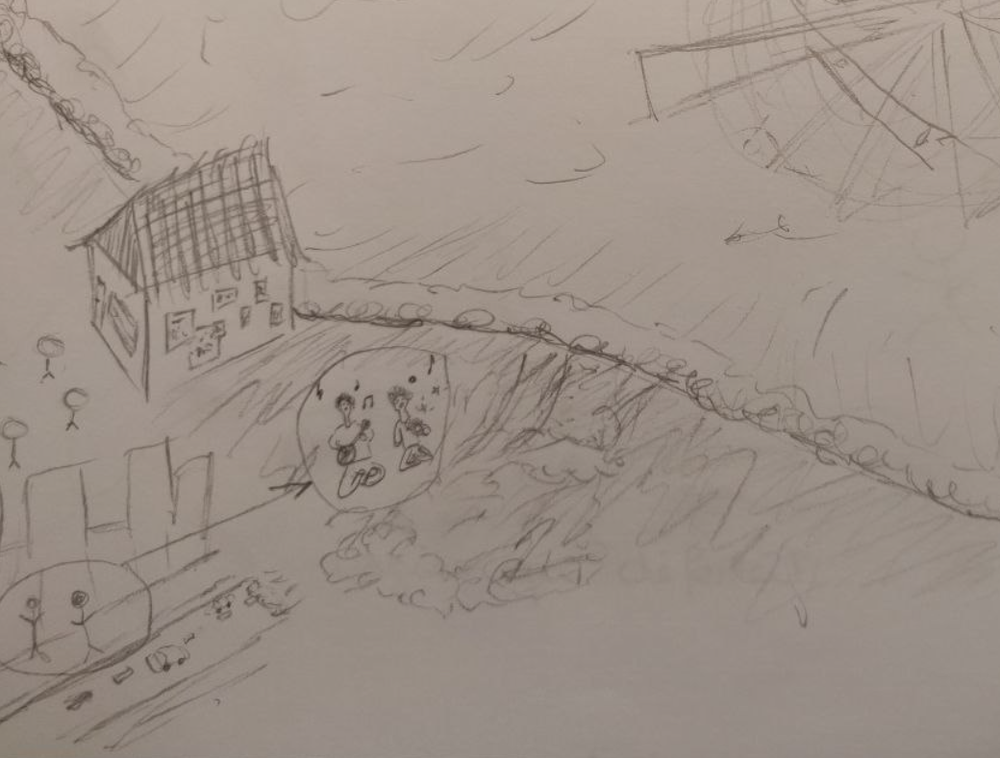

# Oases of Rythm

I continued to record mixtures of sounds in Geneva. So I had four people listen to my three most interesting recordings and draw what they felt while listening. One drawing inspired me: it depicts a scene with two people protecting themselves from the noisy elements with their music and attracting others to join them.

So it gave me the idea of a world of noisy and chaotic sounds where people survive thanks to some natural oases of rhythm or musicians creating their own.

You can find all the drawings and records [here](../process/observations.md#balafon-music).

