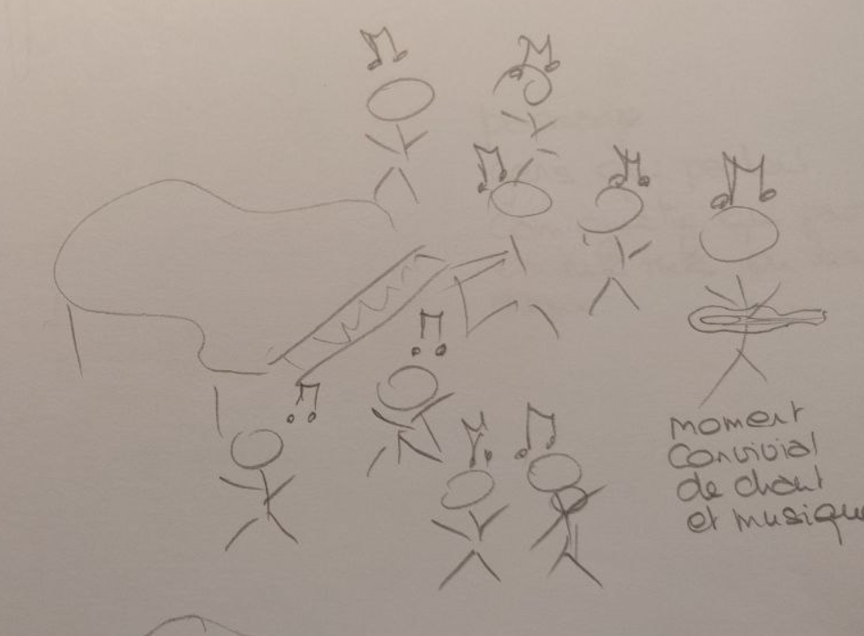

# Inner Beat

It is a world where everyone has to deal with huge noise pollution and it causes many adverse effects on people's health. To survive in everyday life against the auditory attacks, each person has their own inner beat to focus on. However, when noise pollution is too strong, people can synchronise and combine their inner beats to create a stronger sound and so a better protection.

