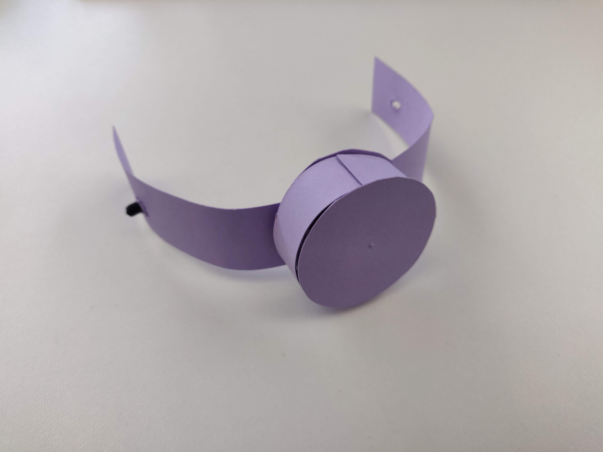
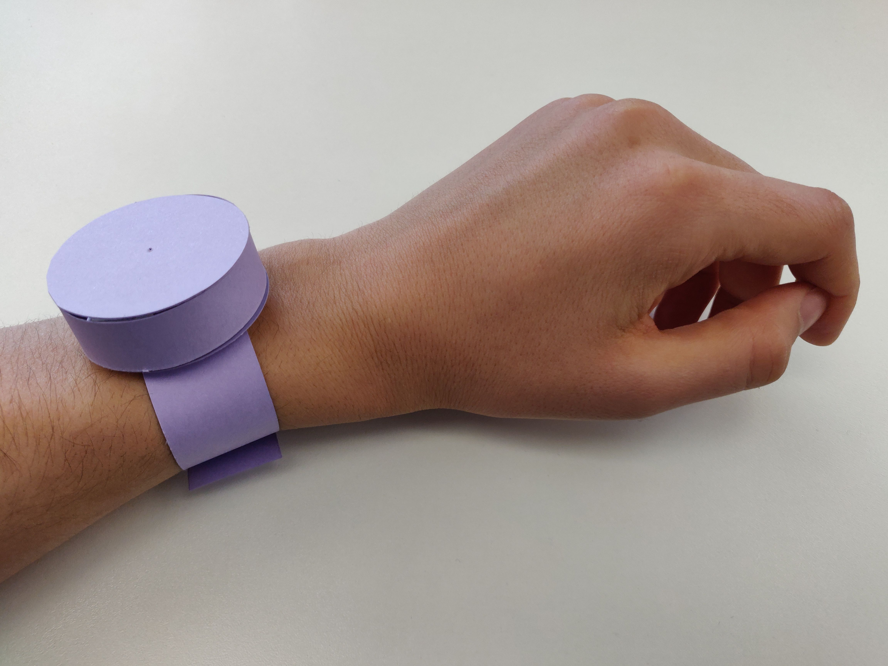
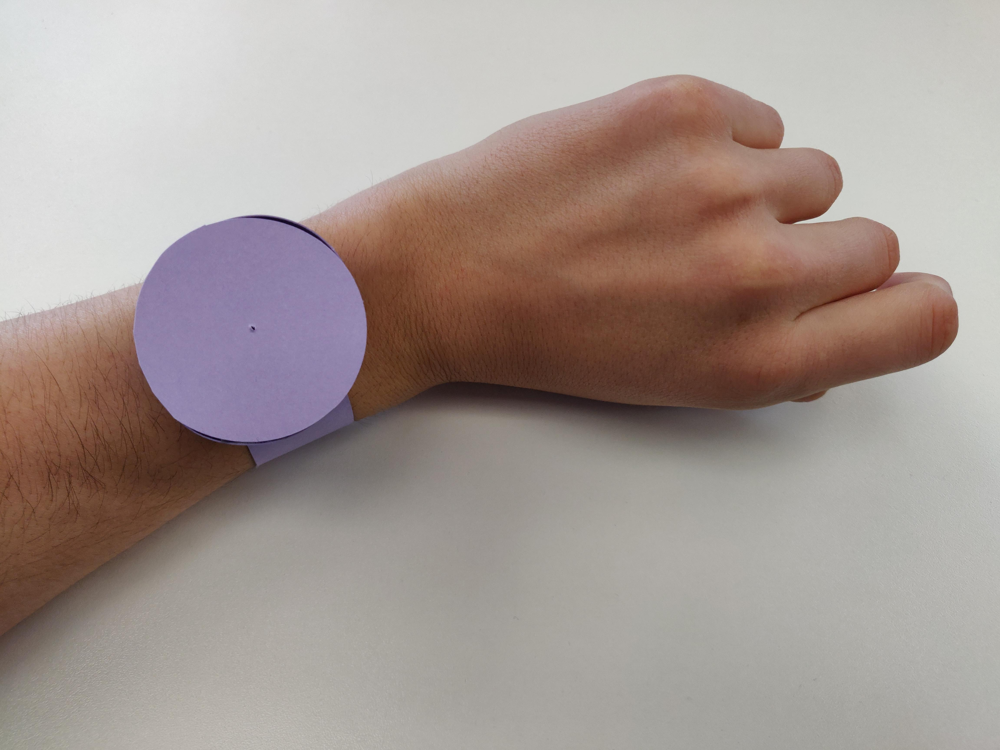

# Paper Prototype

## 2022-12-06

I did a first iteration for the object shape, with this result:

The shape is inspired by both a watch (because you wear on the wrist to feel the heartbeat) and a drum (because you have to tap a beat on it).