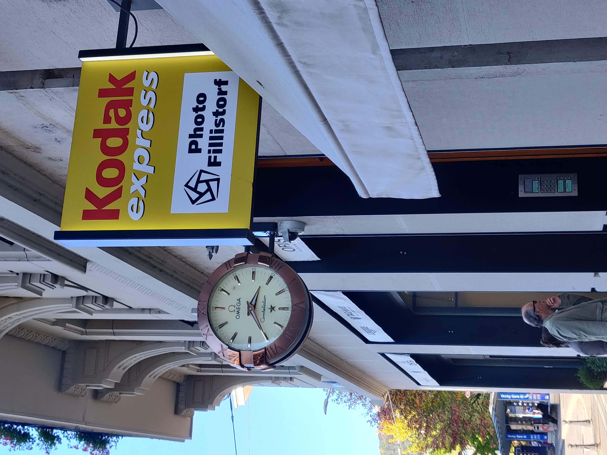

# Some (perhaps) interesting stuff for the project

## 2022-10-22
### Home time
I took a picture of every device where I could watch what time is it (in my house) :

  
  
  
  
  
    
  
  
  ### Plan
  A plan of the time device disposition in the house :
  
  

### Time in the city
#### Records of the bell
##### Vevey - 16h00

https://user-images.githubusercontent.com/33692087/197404087-13735791-bb41-4a34-b373-9b5e5b251863.mp4

##### La Tour-de-Peilz - 17h00

https://user-images.githubusercontent.com/33692087/197404090-9f23d93d-0df8-4edf-9ec9-e69a9aa95f5b.mp4

#### Cities clock
 
   
   
   
   
   

   
   
   
   

  ### Commemorative plaques
   
  
  
  
  
  
  ### Boat schedules
 
   
   

## 2022-10-25
### Phone Time Check
A count of every time check I did on my phone (and a comparaison with Luka's checks) for two days :

## 2022-10-27
I walked around Geneva, taking pictures and recording sounds in the same way as before.

### Country Music
One sound in particular caught my attention: the music of a country music player with the sound of huge constructions in parallel.

https://user-images.githubusercontent.com/33692087/198288109-616338d5-0def-4f51-9843-22d63e3413b4.mp4

## 2022-10-28/29
To continue with the intricate mixed sounds, I captured other sounds. Two of them stand out in particular : a kids riot with a sound of a drop of water and a balafon musician playing in the Eaux-Vives in Geneva. I then selected the interesting moments, and had four people listen to them and draw what the sounds evoked (without knowing what it was).

### Balafon Music

https://user-images.githubusercontent.com/33692087/199069354-9b48b8d0-861b-4f74-905b-21590f6df9b5.mp4

#### Key words
- Carillon
- Xylophone
- École/écoliers
- Endroit de passage
- Personnes
- Tuk Tuk
- Grande rue
- Travaux
- Magasins
- Bois
- Plein de vie
- Marché
- Classe de musique
- Repas de midi
- Caisse magasin
- Cantine
- Mer
- Poissons
- Vagues
 
### Kids Riot

https://user-images.githubusercontent.com/33692087/199071002-c53b1104-8b7f-4a5e-b8c4-53ed84e66b65.mp4

  
#### Key words
- Boule de neige
- Garderie Ikea
- Piscine à boules
- Enfants
- Cuisine
  
### Country Music

https://user-images.githubusercontent.com/33692087/198288109-616338d5-0def-4f51-9843-22d63e3413b4.mp4

  
#### Key words
- Train station
- Music
- USA
- Road trip
- Country
- Ocean
- Noise
- Waves
- Beach
- Memories reminder
- "Help me"
- Musician
- Helicopter

### Sound Tram Doors
During sound selection,  I discovered an interesting analogy between the object emitting the noise, and the shape of the sound wave on the sound recording application.
The recording of a tram journey showed me the sound of doors opening and closing, which sounds like an open door or gate.

