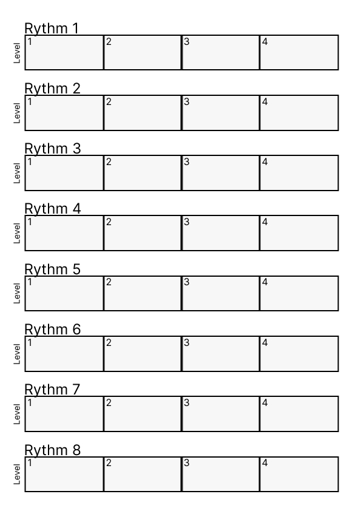
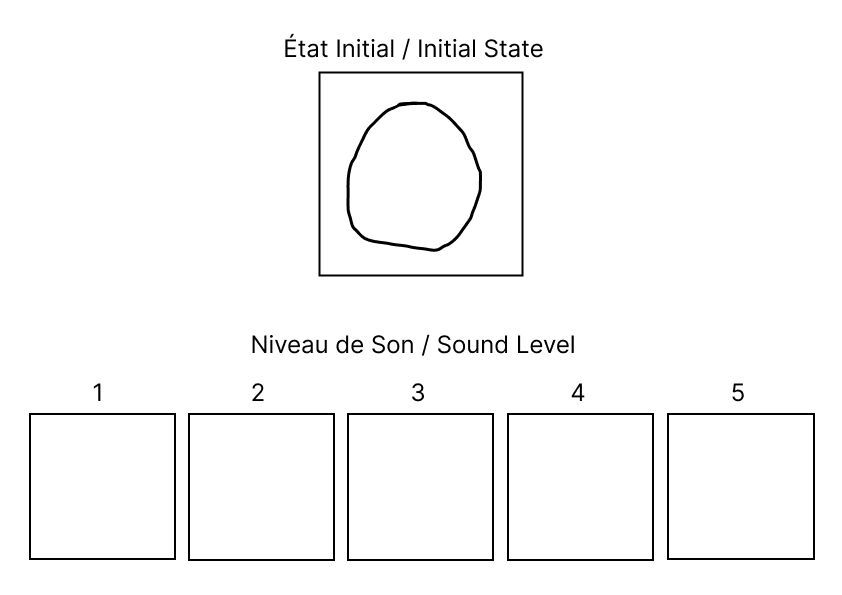

# 

# Test Day (2022-12-21)

## Test What?

- What makes a rhythm difficult to repeat?

- How do people imagine the different stages of deterioration of a blob? 

## Test How?

### Rythm difficulty

1. Recording different rhythms with my iPad

2. Have them listen to the ryhtm

3. Ask them to repeat it by tapping on the table

4. Have them note the difficulty of the rhythm on a template

### Blob state visualization

1. Explain the principle of the blob reacting to sound

2. Have them listen to sounds corresponding to 4 different levels

3. Ask each level to draw the blob that reacts to the sound

## Feedbacks

### Rythm difficulty

- Rhythms, even fast ones, are quite simple to replicate

- Spaces between beats/backbeats should be increased and/or the length of the pattern should be lengthened (to increase difficulty)

- Vibrations are easier to understand that noises with ambiant sounds

### Blob state visualization

- People want to protect the blob

- The style of the blobs is quite consistent between people

- There are various possibilities to use the visuals done

